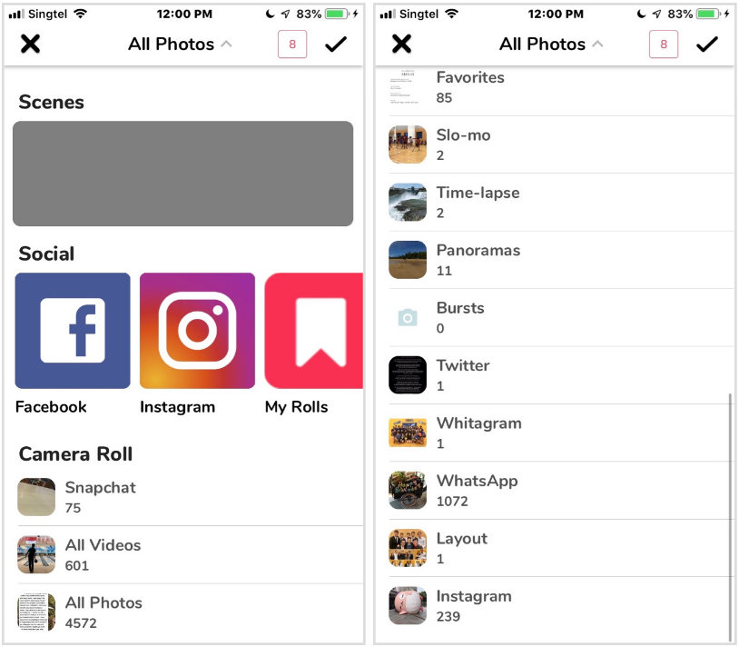
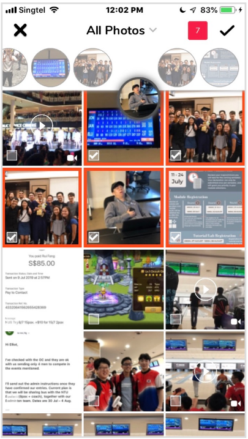
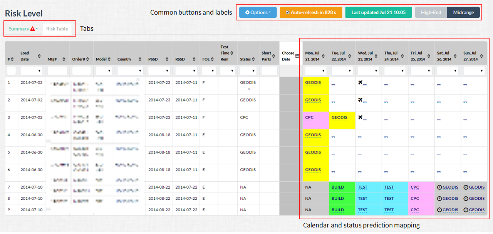
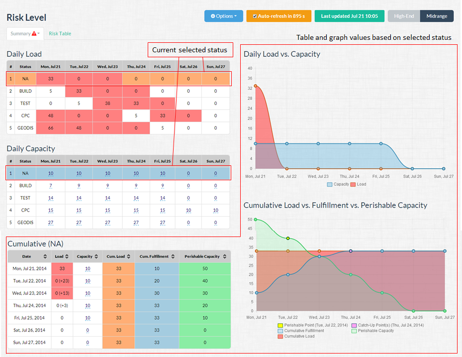

## iOS Developer @ Lomotif
May 2019 – Aug 2019 | Singapore

I interned at Lomotif, a social media mobile application developed by a small Singapore startup that got really popular in the West. Here, I picked up the Swift programming language, and how to develop mobile applications in Xcode.

My main tasks were conceptualizing and prototyping new features. One of them was the in-app notification system and video upload manager features, which actually made it into the live application. I had to work hard to test and integrate them, improving the Lomotif user experience for millions of users worldwide:  
  
_1) Upload progress icon, 2) Upload progress indicators, 3) In-app notifications_

I also prototyped a revamp to the clip picker gallery, to give it a more modern look and feel:  
  
_1) Original gallery, 2) New gallery, 3) New gallery scrolled down_

The clip picker gallery improvements also included a bar where clips selected can be seen at a glance, as well as rearranged:  
  
_1) Original clip picker, 2) New clip picker, featuring a preview bar with clips that can be dragged and dropped_

## Web Developer @ IBM Ireland Product Distribution
Apr 2014 – Aug 2014 | Singapore

This was my first internship, and my first taste of what working a real software development job is like! During my stint at IBM, I picked up Java Servlets and Java Server Pages to  enhance an existing manufacturing tracker dashboard.

The main feature I implemented was a risk analysis tool, so that users are warned about potential lack of parts one week in advance and can act to resolve it. The colourful table cells in the screenshot below was what I improved upon. Each colour represents a different phase of the manufacturing process, and the cells represent the prediction of which phase of manufacturing the product will be in on a particular day. This had to account for non-working days, shortage of parts, as well as other criteria:  
  
_Some information has been blurred out for the sake of privacy_

Also, I proposed and actualized a graphical and interactive presentation of data tables, as I found it to be a more intuitive and powerful visualization tool for the user:  


### Markdown

Markdown is a lightweight and easy-to-use syntax for styling your writing. It includes conventions for

```markdown
Syntax highlighted code block

# Header 1
## Header 2
### Header 3

- Bulleted
- List

1. Numbered
2. List

**Bold** and _Italic_ and `Code` text

[Link](url) and 
```

For more details see [GitHub Flavored Markdown](https://guides.github.com/features/mastering-markdown/).

### Jekyll Themes

Your Pages site will use the layout and styles from the Jekyll theme you have selected in your [repository settings](https://github.com/elliottan/solid-bassoon/settings). The name of this theme is saved in the Jekyll `_config.yml` configuration file.

### Support or Contact

Having trouble with Pages? Check out our [documentation](https://help.github.com/categories/github-pages-basics/) or [contact support](https://github.com/contact) and we’ll help you sort it out.
